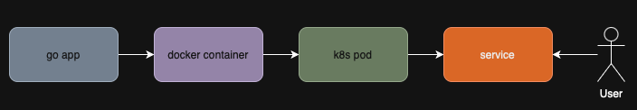

# A Gentle Intro To K8s
In this lab, we experiment with the various tools to learn K8s. 



## What you'll learn
1. How to package your app into a container
2. How to deploy the app with kubernetes

## Glossary
- ***Node***: a machine (real or virtual) where pods are scheduled
- ***Pod***: smallest deployable unit in k8s; holds 1+ containers
- ***Deployment***: keeps your app running and scaled
- ***Service***: stable IP + DNS name for a set of pods
- ***NodePort***: exposes a service on each node’s IP:port
- ***Kind***: runs a k8s cluster with docker containers 

## Dependencies 
- [Docker Desktop](https://docs.docker.com/desktop/setup/install/mac-install/)
- [kind](https://kind.sigs.k8s.io/docs/user/quick-start)
- optionally (if you want to run the go code locally) [go](https://go.dev/dl/)

## Decisions
### Why golang?
I chose Go because it’s expressive and compiles quickly. More than that, Go’s philosophy centers on simplicity. What you build can be complex, but you should always fight--to the extent that you can--to keep things simple. 

The main function is only 6 lines: 
```go
func main() {
	http.HandleFunc("/", jsonHandler)
	if err := http.ListenAndServe(":8080", nil); err != nil {
		log.Printf("failed to stand up server: %v\n", err)
	}
}
```

### Why Docker
We'll build the container image using docker (familiar interface and widely popular). Fun fact: Docker itself is not a container runtime interface (CRI). It wraps around containerd. There are other CRIs available that solve the same problem.

### Why Kubernetes
Every design decision comes with a cost. When you reach for a tool, you should think "what does this buy me?". 
Kubernetes is pervasive. It’s written in Go. Due to its popularity and kubectl’s intuitive interface, it’s a great tool for learning orchestration. It buys you a suite of APIs to deploy and manage your infrastructure. 

## Let's get started
We're going to build a container image using the small go app. The files for the image specifics as well as the commands are provided. With go, you can choose how you want to package your app. This decision can drastically affect the image size. 

To illustrate image size, we are going to take a naive approach to building the go image. Then we'll optimize it reducing the size of the image. 

Next, we'll use KIND to deploy our image in a k8s cluster, exploring the kubectl CLI to check the status and get information about the workload. 

## Build the image 
In go, you can ship the container:
- with the compiler and toolchain (OR)
- only the executable

This is like leaving the house with a suitcase containing a gift vs just carrying the gift.

### Packing a suitcase (with a gift inside)

#### Create the suitcase file
```bash
cat <<EOF > Dockerfile.suitcase
FROM golang:1.23.5

WORKDIR /app

COPY . .

RUN go build -o server .

EXPOSE 8080

CMD ["./server"]
EOF
```
#### Build the image

It's customary to use [semantic versioning](https://semver.org) for the image tag.
I typically go with the most meaningful and simple name followed by semver, a colon separating them.  

```bash
docker build -f Dockerfile.suitcase -t learn-k8s:v0.1.0 .
```

#### How big is the image
```bash
docker image ls learn-k8s:v0.1.0
```

```bash
➜  learn-k8s docker image ls learn-k8s:v0.1.0

REPOSITORY                       TAG       IMAGE ID       CREATED          SIZE
learn-k8s                        v0.1.0    ad0eccda48f9   18 seconds ago   928MB
```

### Just the gift

***Note***: it is convention to call this file unsuprisingly: `Dockerfile`

#### Create the gift file
```bash
cat <<EOF > Dockerfile.gift
FROM golang:1.23.5 AS builder

WORKDIR /src

COPY . .

RUN CGO_ENABLED=0 GOOS=linux GOARCH=amd64 go build -o /out/server .

FROM scratch

COPY --from=builder /out/server /server

EXPOSE 8080

ENTRYPOINT ["/server"]
EOF
```

#### Build the image
```bash
docker build -f Dockerfile.gift -t learn-k8s:v0.2.0 .
```

#### How big are the images
```bash
docker image ls learn-k8s
```

```bash
➜  learn-k8s docker image ls learn-k8s

REPOSITORY                       TAG       IMAGE ID       CREATED              SIZE
learn-k8s                        v0.2.0    e5f7398be391   3 seconds ago        7.7MB
learn-k8s                        v0.1.0    ad0eccda48f9   About a minute ago   928MB
```

There is a considerable difference in the image size. 

Let's now hit our API. 

### Stand up the container and hit the API

Because our app runs inside a container, we need to map a container port to the host. This is what `-p 8080:8080` is doing. 

For posterity, `--rm` just means remove the container once you stop it with `ctrl + c` and `learn-k8s:v0.2.0` is the image (if that wasn't obvious).

```bash
docker run --rm -p 8080:8080 learn-k8s:v0.2.0
# in another terminal 
curl localhost:8080 | jq .
```

### Look at the container 
```bash
➜  learn-k8s docker container ls 
CONTAINER ID   IMAGE              COMMAND     CREATED          STATUS          PORTS                    NAMES
e82471cb3ffd   learn-k8s:v0.2.0   "/server"   56 seconds ago   Up 54 seconds   0.0.0.0:8080->8080/tcp   elated_meitner
```

Notice the creative name elated_meitner. If you want to use a more meaningful name, add an arg to the run command. 
```bash
docker run --rm -p 8080:8080 --name learn-k8s learn-k8s:v0.2.0
# again in another terminal
➜  learn-k8s docker container ls 
CONTAINER ID   IMAGE              COMMAND     CREATED         STATUS         PORTS                    NAMES
61cdd1480406   learn-k8s:v0.2.0   "/server"   3 seconds ago   Up 2 seconds   0.0.0.0:8080->8080/tcp   learn-k8s
```

### The hostname of the container 
In case you were wondering, here is how to grab the hostname of the container. 
```bash
# assuming you're using the '--name' arg with 'docker run'
docker inspect learn-k8s | jq -r '.[0].Config.Hostname'
```

To kill the container run: `ctrl + c`

Finally, let's deploy our app with kubernetes. 

## Kubernetes
Kubernetes is declarative and intent-based. You tell it what you want, and it works to make reality match that plan. Think of it like a stage manager who keeps the show running even if an actor goes missing.

We use different resource types for different jobs. Here we’ll use:
- a **Deployment** to run two copies of our app, and
- a **Service** to give those pods a stable front door.

If our API only talked to other services inside the cluster, we could keep it private. But we want to call it from our laptop, so we’ll expose it.

### Manifest files
#### Deployment Manifest
```bash
cat <<EOF > k8s/deployment.yaml
apiVersion: apps/v1
kind: Deployment
metadata:
  name: learn-k8s
  labels:
    app: learn-k8s
spec:
  replicas: 2
  selector:
    matchLabels:
      app: learn-k8s
  template:
    metadata:
      labels:
        app: learn-k8s
    spec:
      containers:
        - name: learn-k8s
          image: learn-k8s:v0.2.0
          imagePullPolicy: IfNotPresent
          ports:
            - containerPort: 8080
EOF
```

#### Service Manifest
```bash
cat <<EOF > k8s/service.yaml
apiVersion: v1
kind: Service
metadata:
  name: learn-k8s
  labels:
    app: learn-k8s
spec:
  type: ClusterIP
  selector:
    app: learn-k8s
  ports:
    - name: http
      port: 80
      targetPort: 8080
EOF
```

## Create a KIND cluster with host port mapping
KIND needs a cluster config to expose node ports on your host. Because it’s kind (pun intended) of expensive to rebuild, we’ll map the port up front.

```bash
cat <<EOF > kind-config.yaml
kind: Cluster
apiVersion: kind.x-k8s.io/v1alpha4
nodes:
  - role: control-plane
    extraPortMappings:
      - containerPort: 30080
        hostPort: 8080
        protocol: TCP
EOF
```

### Create the cluster with kind
```bash
kind create cluster --config kind-config.yaml
```

## What to expect
We’ll end up with two pods and one service. The service will round‑robin traffic so each request lands on a different pod.

### Check for pods
We haven’t created any yet, so there should be no pods. Trust but verify.

```bash
➜  learn-k8s kubectl get pods 
No resources found in default namespace.
```

### Add the local Docker image into the KIND cluster
KIND runs inside Docker, so it can’t see your local images unless you load them in.

```bash
kind load docker-image learn-k8s:v0.2.0
```

### View the container in the infra container:
This shows the image inside the node container where the cluster will pull it from.

```bash
docker exec -it kind-control-plane crictl images
```

In case it's not obvious (and why would it be?) the image is `docker.io/library/learn-k8s`. 

## Let's stand up our app inside the cluster.
Deploying with Kubernetes differs from Docker in many ways, but networking is the big one. Docker is local networking; Kubernetes is an IP fabric. Each pod gets its own network namespace and IP.

That means there’s a veth pair: one end in the pod, one end on the node. We’ll peek at that shortly.

```bash
kubectl apply -f k8s/deployment.yaml
```

```bash
➜  learn-k8s kubectl get pods 
NAME                        READY   STATUS    RESTARTS   AGE
learn-k8s-9f554cb4f-6zcgt   1/1     Running   0          2s
learn-k8s-9f554cb4f-nxj2h   1/1     Running   0          3s
```

## Check the veth pair (under construction | kind is different)
```bash
# 1) List pod IDs in the node container
docker exec -it kind-control-plane crictl pods

# 2) Get the pod sandbox (pause) container ID
docker exec -it kind-control-plane crictl ps --name learn-k8s

# 3) Find the netns path for that sandbox container
docker exec -it kind-control-plane crictl inspect <POD_SANDBOX_ID> | jq -r '.info.runtimeSpec.linux.namespaces[] | select(.type=="network") | .path'
# docker exec -it kind-control-plane crictl inspect bd6265a543cb6 | jq -r '.info.runtimeSpec.linux.namespaces[] | select(.type=="network") | .path'

# ➜  learn-k8s docker exec -it kind-control-plane crictl inspect ac91106fb60dd | jq -r '.info.runtimeSpec.linux.namespaces[] | select(.type=="network") | .path'
# /proc/1982/ns/net

# 4) Show the veth inside the pod namespace
docker exec -it kind-control-plane nsenter --net=<NETNS_PATH> ip link

# 5) Show the peer veth on the node side (match by ifindex)
docker exec -it kind-control-plane ip link


# Inside pod netns (pod side IP)
docker exec -it kind-control-plane nsenter --net=<NETNS_PATH> ip -br addr show eth0
# ➜  learn-k8s docker exec -it kind-control-plane nsenter --net=/proc/1982/ns/net ip -br addr show eth0
# eth0@if8         UP             10.244.0.6/24 fe80::8865:8eff:febc:b560/64 


# ➜  learn-k8s kubectl get pods -o wide
# NAME                        READY   STATUS    RESTARTS   AGE   IP           NODE                 NOMINATED NODE   READINESS GATES
# learn-k8s-9f554cb4f-2hm68   1/1     Running   0          21m   10.244.0.6   kind-control-plane   <none>           <none>
# learn-k8s-9f554cb4f-lxrr7   1/1     Running   0          21m   10.244.0.5   kind-control-plane   <none>           <none>

# On node (host side IP) — find the matching veth by ifindex from `eth0@ifX`
docker exec -it kind-control-plane ip -br addr show <veth_name>
```


## Try to hit the API
```bash
➜  learn-k8s  curl localhost:8080 | jq 
  % Total    % Received % Xferd  Average Speed   Time    Time     Time  Current
                                 Dload  Upload   Total   Spent    Left  Speed
  0     0    0     0    0     0      0      0 --:--:-- --:--:-- --:--:--     0
curl: (56) Recv failure: Connection reset by peer
```

Bummer! Why isn’t it working? We don’t have a NodePort yet—let’s add the service.

### Deploy your POD and Service 
```bash
kubectl apply -f k8s/service.yaml
# or to apply both 
# kubectl apply -f k8s/.
```

```bash
➜  learn-k8s kubectl get svc learn-k8s
NAME        TYPE       CLUSTER-IP     EXTERNAL-IP   PORT(S)        AGE
learn-k8s   NodePort   10.96.195.50   <none>        80:30080/TCP   102s
```

Then make the service a NodePort (or update the manifest) so it binds to `30080`:

```bash
kubectl patch service learn-k8s -p '{"spec": {"type": "NodePort", "ports": [{"port": 80, "targetPort": 8080, "nodePort": 30080}]}}'
```

You can now hit the app at `http://localhost:8080`.

### Load balancer doing its thing
```bash
➜  learn-k8s curl localhost:8080 | jq 
  % Total    % Received % Xferd  Average Speed   Time    Time     Time  Current
                                 Dload  Upload   Total   Spent    Left  Speed
100    87  100    87    0     0   2541      0 --:--:-- --:--:-- --:--:--  2558
{
  "time_stamp": "2026-01-11T10:37:28.087747008Z",
  "hostname": "learn-k8s-9f554cb4f-6zcgt"
}
➜  learn-k8s curl localhost:8080 | jq 
  % Total    % Received % Xferd  Average Speed   Time    Time     Time  Current
                                 Dload  Upload   Total   Spent    Left  Speed
100    87  100    87    0     0   6044      0 --:--:-- --:--:-- --:--:--  6214
{
  "time_stamp": "2026-01-11T10:37:30.431948593Z",
  "hostname": "learn-k8s-9f554cb4f-nxj2h"
}
```

### K8s commands 
```bash
➜  learn-k8s kubectl describe pod learn-k8s-9f554cb4f-6zcgt
Name:             learn-k8s-9f554cb4f-6zcgt
Namespace:        default
Priority:         0
Service Account:  default
Node:             kind-control-plane/172.19.0.2
Start Time:       Sun, 11 Jan 2026 04:36:59 -0600
Labels:           app=learn-k8s
                  pod-template-hash=9f554cb4f
Annotations:      <none>
Status:           Running
IP:               10.244.0.9
IPs:
  IP:           10.244.0.9
Controlled By:  ReplicaSet/learn-k8s-9f554cb4f
Containers:
  learn-k8s:
    Container ID:   containerd://7364db8621c1c2d765be9f34e02769d64119e46275861b7c891fec0d680ac69b
    Image:          learn-k8s:v0.2.0
    Image ID:       docker.io/library/import-2026-01-11@sha256:dfe52d465ba76f10821218ccf8412fdc629daed3c4f50b935d3fb561031df0e2
    Port:           8080/TCP
    Host Port:      0/TCP
    State:          Running
      Started:      Sun, 11 Jan 2026 04:36:59 -0600
    Ready:          True
    Restart Count:  0
    Environment:    <none>
    Mounts:
      /var/run/secrets/kubernetes.io/serviceaccount from kube-api-access-4stb8 (ro)
Conditions:
  Type                        Status
  PodReadyToStartContainers   True 
  Initialized                 True 
  Ready                       True 
  ContainersReady             True 
  PodScheduled                True 
Volumes:
  kube-api-access-4stb8:
    Type:                    Projected (a volume that contains injected data from multiple sources)
    TokenExpirationSeconds:  3607
    ConfigMapName:           kube-root-ca.crt
    ConfigMapOptional:       <nil>
    DownwardAPI:             true
QoS Class:                   BestEffort
Node-Selectors:              <none>
Tolerations:                 node.kubernetes.io/not-ready:NoExecute op=Exists for 300s
                             node.kubernetes.io/unreachable:NoExecute op=Exists for 300s
Events:
  Type    Reason     Age    From               Message
  ----    ------     ----   ----               -------
  Normal  Scheduled  5m55s  default-scheduler  Successfully assigned default/learn-k8s-9f554cb4f-6zcgt to kind-control-plane
  Normal  Pulled     5m55s  kubelet            Container image "learn-k8s:v0.2.0" already present on machine
  Normal  Created    5m55s  kubelet            Created container learn-k8s
  Normal  Started    5m55s  kubelet            Started container learn-k8s
```

### Scale out the hard way
```bash
➜  learn-k8s kubectl scale --replicas=3 -f k8s/deployment.yaml
deployment.apps/learn-k8s scaled
➜  learn-k8s kubectl get pods                                 
NAME                        READY   STATUS    RESTARTS   AGE
learn-k8s-9f554cb4f-6zcgt   1/1     Running   0          8m18s
learn-k8s-9f554cb4f-7wg8x   1/1     Running   0          5s
learn-k8s-9f554cb4f-nxj2h   1/1     Running   0          8m19s
```

### Hit the API again. 
#### Questions
Look at the hostnames. 
- What strategy does the load balancer use?


### delete resources
```bash
➜  learn-k8s kubectl delete -f k8s/. 
deployment.apps "learn-k8s" deleted
service "learn-k8s" deleted
```

### Delete kind cluster 
```bash
➜  learn-k8s kind delete clusters kind
Deleted nodes: ["kind-control-plane"]
Deleted clusters: ["kind"]
➜  learn-k8s kind get clusters        
No kind clusters found.
```

### Delete images
```bash
docker image rm learn-k8s:v0.1.0
docker image rm learn-k8s:v0.2.0
```

## TODO
- [ ] actually provide the proper commands to show the veth pair
- [ ] add ubuntu pods so we can show east/west traffic with ping (no svc needed)
