# A Gentle Intro To K8s

- [A Gentle Intro To K8s](#a-gentle-intro-to-k8s)
  - [What you'll learn](#what-youll-learn)
  - [Glossary](#glossary)
  - [Dependencies](#dependencies)
  - [Decisions](#decisions)
    - [Why golang?](#why-golang)
    - [Why Docker](#why-docker)
    - [Why Kubernetes](#why-kubernetes)
  - [What we're going to do](#what-were-going-to-do)
  - [Let's get started](#lets-get-started)
  - [Build the image](#build-the-image)
    - [Packing a suitcase (with a gift inside)](#packing-a-suitcase-with-a-gift-inside)
      - [Create the suitcase file](#create-the-suitcase-file)
      - [Build the image](#build-the-image-1)
      - [How big is the image?](#how-big-is-the-image)
      - [Example](#example)
    - [Just the gift](#just-the-gift)
      - [Create the gift file](#create-the-gift-file)
      - [Build the image](#build-the-image-2)
      - [How big are the images?](#how-big-are-the-images)
      - [Example](#example-1)
    - [Stand up the container and hit the API](#stand-up-the-container-and-hit-the-api)
      - [Example output](#example-output)
    - [Look at the container](#look-at-the-container)
      - [Example](#example-2)
      - [Example](#example-3)
    - [The hostname of the container](#the-hostname-of-the-container)
  - [Kubernetes](#kubernetes)
    - [Manifest files](#manifest-files)
      - [Deployment Manifest](#deployment-manifest)
      - [Service Manifest](#service-manifest)
  - [Create a KIND cluster with host port mapping](#create-a-kind-cluster-with-host-port-mapping)
    - [Create the cluster with kind](#create-the-cluster-with-kind)
  - [What to expect](#what-to-expect)
    - [Check for pods](#check-for-pods)
      - [Example](#example-4)
    - [Add the local Docker image into the KIND cluster](#add-the-local-docker-image-into-the-kind-cluster)
    - [View the container in the infra container](#view-the-container-in-the-infra-container)
      - [Example](#example-5)
  - [Let's stand up our app inside the cluster](#lets-stand-up-our-app-inside-the-cluster)
    - [View the PODS](#view-the-pods)
  - [Add a networking sidecar container](#add-a-networking-sidecar-container)
  - [Check the veth pair](#check-the-veth-pair)
    - [Get the list of interfaces](#get-the-list-of-interfaces)
      - [Example](#example-6)
      - [Get the container ID or name](#get-the-container-id-or-name)
      - [Example](#example-7)
  - [Try to hit the API](#try-to-hit-the-api)
      - [Example](#example-8)
    - [Deploy your POD and Service](#deploy-your-pod-and-service)
      - [Example](#example-9)
    - [Load balancer doing its thing](#load-balancer-doing-its-thing)
    - [K8s commands](#k8s-commands)
    - [Scale out the hard way](#scale-out-the-hard-way)
    - [Hit the API again.](#hit-the-api-again)
      - [Questions](#questions)
    - [You can see both containers in the pod](#you-can-see-both-containers-in-the-pod)
    - [Run networking commands](#run-networking-commands)
  - [Clean up this cluster](#clean-up-this-cluster)
  - [Add a CNI for BGP Peerings](#add-a-cni-for-bgp-peerings)
    - [Start the cluster](#start-the-cluster)
    - [install calico](#install-calico)
    - [setup whisker](#setup-whisker)
    - [Setup namespace and deploy some pods to test connectivity](#setup-namespace-and-deploy-some-pods-to-test-connectivity)
    - [IP Pools](#ip-pools)
      - [Example](#example-10)
    - [BGP Peer Info](#bgp-peer-info)
    - [Clean up](#clean-up)
    - [Delete images](#delete-images)

In this lab, we experiment with the various tools to learn K8s. 

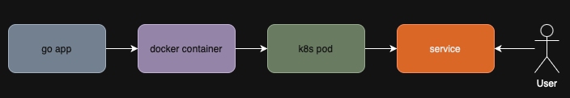

## What you'll learn
1. How to package your app into a container
2. How to deploy the app with kubernetes

## Glossary
- ***Node***: a machine (real or virtual) where pods are scheduled
- ***Pod***: smallest deployable unit in k8s; holds 1+ containers
- ***Deployment***: keeps your app running and scaled
- ***Service***: stable IP + DNS name for a set of pods
- ***NodePort***: exposes a service on each node’s IP:port
- ***Kind***: runs a k8s cluster with docker containers 

## Dependencies 
- Install [Docker Desktop](https://docs.docker.com/desktop/setup/install/mac-install/)
- Install [kind](https://kind.sigs.k8s.io/docs/user/quick-start)
- Optionally (if you want to run the go code locally) install [go](https://go.dev/dl/)

## Decisions
### Why golang?
I chose Go because it’s expressive and compiles quickly. More than that, Go’s philosophy centers on simplicity. What you build can be complex, but you should always fight--to the extent that you can--to keep things simple. 

The main function is only 7 lines: 
```go
func main() {
	http.HandleFunc("/", jsonHandler)
	log.Printf("standing up server on %v\n", socket)
	if err := http.ListenAndServe(socket, nil); err != nil {
		log.Printf("failed to stand up server: %v\n", err)
	}
}
```

### Why Docker
We'll build the container image using docker (familiar interface and widely popular). Fun fact: Docker itself is not a container runtime interface (CRI). It wraps around containerd. There are other CRIs available that solve the same problem.

### Why Kubernetes
Every design decision comes with a cost. When you reach for a tool, you should think "what does this buy me?". 
Kubernetes is pervasive. It’s written in Go. Due to its popularity and kubectl’s intuitive interface, it’s a great tool for learning orchestration. It buys you a suite of APIs to deploy and manage your infrastructure. 

## What we're going to do
We're going to build a container image using the small go app. We'll create all the files as wel go, running various verification commands. 

With go, you can choose how you want to package your app. This decision can drastically affect the image size as you'll soon see. 

To illustrate image size, we are going to take a naive approach to building the go image. Then we'll optimize it reducing the size of the image. 

Next, we'll use KIND to deploy our image in a k8s cluster, exploring the kubectl CLI to check the status and get information about the workload. 

Finally, we'll hit our API multiple times to see how the load balancer works, and then we'll tear everything down. 

## Let's get started
## Build the image 
In go, you can ship the container:
- with the compiler and toolchain (OR)
- only the executable

This is like leaving the house with a suitcase containing a gift vs just carrying the gift.

### Packing a suitcase (with a gift inside)

#### Create the suitcase file
```bash
cat <<EOF > Dockerfile.suitcase
# This is the base image we are going to use.
FROM golang:1.23.5

# Where our application will sit in the container. 
WORKDIR /app

# We're copying everything from the host into the container. This is not best practice. 
COPY . .

# Compiling the code into an executable. 
RUN go build -o server .

# Making a socket available. 
EXPOSE 8080

# Run the executable. 
CMD ["./server"]
EOF
```
#### Build the image

It's customary to use [semantic versioning](https://semver.org) for the image tag.
I typically go with the most meaningful and simple name followed by semver, a colon separating them.  

```bash
docker build -f Dockerfile.suitcase -t learn-k8s:v0.1.0 .
```

#### How big is the image?
```bash
docker image ls learn-k8s
```

#### Example
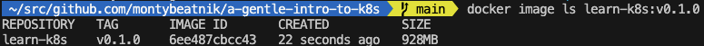

### Just the gift

***Note***: it is convention to call this file unsuprisingly: `Dockerfile`

#### Create the gift file
```bash
cat <<EOF > Dockerfile.gift
FROM golang:1.23.5 AS builder

WORKDIR /src

COPY . .

RUN CGO_ENABLED=0 GOOS=linux GOARCH=amd64 go build -o /out/server .

FROM scratch

COPY --from=builder /out/server /server

EXPOSE 8080

ENTRYPOINT ["/server"]
EOF
```

#### Build the image
```bash
docker build -f Dockerfile.gift -t learn-k8s:v0.2.0 .
```

#### How big are the images?
```bash
docker image ls learn-k8s
```

#### Example
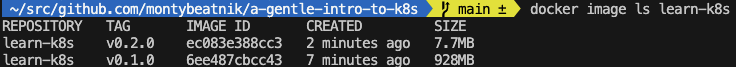

There is a considerable difference in the image size. 

Let's now hit our API. 

### Stand up the container and hit the API

Because our app runs inside a container, we need to map a container port to the host. This is what `-p 8080:8080` is doing. 

For posterity, `--rm` just means remove the container once you stop it with `ctrl + c` and `learn-k8s:v0.2.0` is the image (if that wasn't obvious).

```bash
docker run --rm -p 8080:8080 learn-k8s:v0.2.0
# in another terminal 
curl localhost:8080 | jq .
```

#### Example output
```json
{
  "time_stamp": "2026-03-31T18:44:10.68935521Z",
  "hostname": "43ea6b3eaf4a"
}
```

### Look at the container 
```bash
docker container ls
```

#### Example
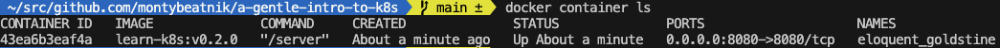

Notice the creative name eloquent_goldstine. If you want to use a more meaningful name, add an arg to the run command. 
```bash
docker run --rm -p 8080:8080 --name learn-k8s learn-k8s:v0.2.0
# again in another terminal
docker container ls 
```

#### Example

### The hostname of the container 
In case you were wondering, here is how to grab the hostname of the container. 
```bash
# assuming you're using the '--name' arg with 'docker run'
docker inspect learn-k8s | jq -r '.[0].Config.Hostname'
```

To kill the container run: `ctrl + c`

Finally, let's deploy our app with kubernetes. 

## Kubernetes
Kubernetes is declarative and intent-based. You tell it what you want, and it works to make reality match that plan. Think of it like a stage manager who keeps the show running even if an actor goes missing.

We use different resource types for different jobs. Here we’ll use:
- a **Deployment** to run two copies of our app, and
- a **Service** to give those pods a stable front door.

If our API only talked to other services inside the cluster, we could keep it private. But we want to call it from our laptop, so we’ll expose it.

### Manifest files
#### Deployment Manifest
```bash
cat <<EOF > k8s/deployment.yaml
apiVersion: apps/v1
kind: Deployment
metadata:
  name: learn-k8s
  labels:
    app: learn-k8s
spec:
  replicas: 2
  selector:
    matchLabels:
      app: learn-k8s
  template:
    metadata:
      labels:
        app: learn-k8s
    spec:
      containers:
        - name: learn-k8s
          image: learn-k8s:v0.2.0
          imagePullPolicy: IfNotPresent
          ports:
            - containerPort: 8080
EOF
```

#### Service Manifest
```bash
cat <<EOF > k8s/service.yaml
apiVersion: v1
kind: Service
metadata:
  name: learn-k8s
  labels:
    app: learn-k8s
spec:
  type: ClusterIP
  selector:
    app: learn-k8s
  ports:
    - name: http
      port: 80
      targetPort: 8080
EOF
```

## Create a KIND cluster with host port mapping
KIND needs a cluster config to expose node ports on your host. Because it’s kind (pun intended) of expensive to rebuild, we’ll map the port up front.

```bash
cat <<EOF > kind-config.yaml
kind: Cluster
apiVersion: kind.x-k8s.io/v1alpha4
nodes:
  - role: control-plane
    extraPortMappings:
      - containerPort: 30080
        hostPort: 8080
        protocol: TCP
EOF
```

### Create the cluster with kind
```bash
kind create cluster --config kind-config.yaml
```

## What to expect
We’ll end up with two pods and one service. The service will round‑robin traffic so each request lands on a different pod.

### Check for pods
We haven’t created any yet, so there should be no pods. Trust but verify.

```bash
kubectl get pods 
```

#### Example
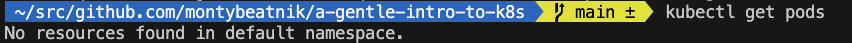

### Add the local Docker image into the KIND cluster
KIND runs inside Docker, so it can’t see your local images unless you load them in.

```bash
kind load docker-image learn-k8s:v0.2.0
```

### View the container in the infra container
This shows the image inside the node container where the cluster will pull it from.

```bash
docker exec -it kind-control-plane crictl images
```

#### Example
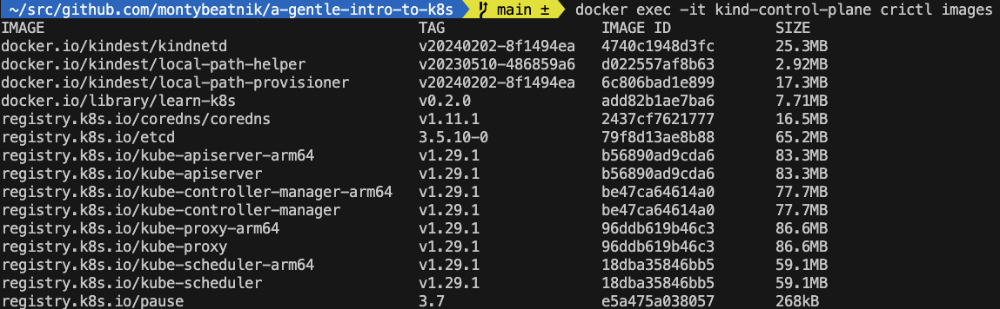

In case it's not obvious (and why would it be?) the image is `docker.io/library/learn-k8s`. 

## Let's stand up our app inside the cluster
Deploying with Kubernetes differs from Docker in many ways, but networking is the big one. Docker is local networking; Kubernetes is an IP fabric. Each pod gets its own network namespace and IP.

That means there’s a veth pair: one end in the pod, one end on the node. We’ll peek at that shortly.

```bash
kubectl apply -f k8s/deployment.yaml
```

### View the PODS
```bash
kubectl get pods
```

```bash
➜  learn-k8s kubectl get pods 
NAME                        READY   STATUS    RESTARTS   AGE
learn-k8s-9f554cb4f-6zcgt   1/1     Running   0          2s
learn-k8s-9f554cb4f-nxj2h   1/1     Running   0          3s
```

## Add a networking sidecar container 
We used a multi-stage build for out container. This left us with only the binary. If you want to run tools like `ping`, `dig`, `curl`, or `traceroute` in the same network namespace as your app, add a small sidecar container to the pod template. The sidecar shares the pod network, so it can reach the same IPs and ports as the app container.

Add a second container to `k8s/deployment.yaml`:

```yaml
# Replace the existing containers var with this block.
      containers:
        - name: learn-k8s
          image: learn-k8s:v0.2.0
          imagePullPolicy: IfNotPresent
          ports:
            - containerPort: 8080
        - name: net-tools
          image: nicolaka/netshoot:latest
          command: ["sleep", "infinity"]
```

Re-apply the deployment, then exec into the sidecar:

```bash
kubectl apply -f k8s/deployment.yaml
kubectl exec -it deploy/learn-k8s -c net-tools -- bash
```

From that shell, run your networking commands (for example: `ping <ip>`, `dig <name>`, `curl http://<pod-ip>:8080`).

## Check the veth pair

### Get the list of interfaces
```bash
ip l
```

#### Example
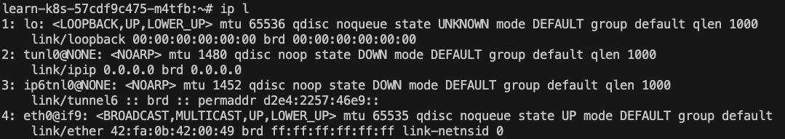

Unless you use a CNI like Multus, you will only have 1 eth interface in your pod. That interface is eth0. 

The veth pair at index 4 reads `eth0`, which is the local namespace interface, connects to `if9` the remote end that lives on the host. 

We go to the host and look for if9. 

#### Get the container ID or name
```bash
docker container ls 
```

```bash
docker exec -it kind-control-plane bash
```

#### Example
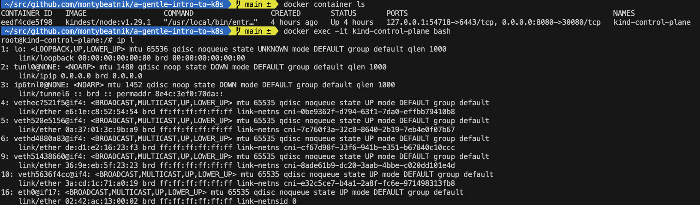

Show the address with the following: 
```bash
ip -br addr show veth51438660
```

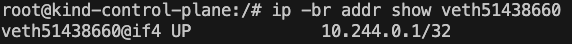

Let's pop back over to the pod's sidecar container and run a traceroute to google's DNS. 

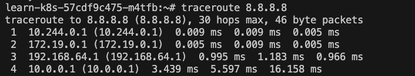

Now that we've dabbled with the network plumbing a bit, let's try to hit our API running in the pod. 

## Try to hit the API
Before our API was running in a local container via the docker desktop. Now our API is running in a container in a k8s pod. 
```bash
curl localhost:8080 | jq 
```

#### Example
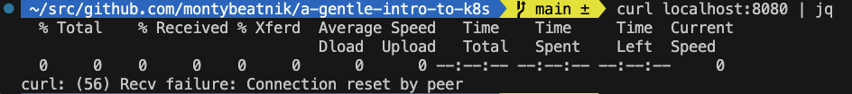

Bummer! Why isn’t it working? We don’t have a NodePort yet—let’s add the service.

### Deploy your POD and Service 
```bash
kubectl apply -f k8s/service.yaml
```


```bash
kubectl get svc learn-k8s
```

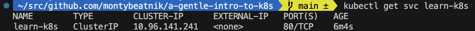

You can drop into the shell of one of the PODs and you can hit the API. 

```bash
kubectl exec -it deploy/learn-k8s -c net-tools -- bash
curl 10.244.0.8:8080 
```

#### Example
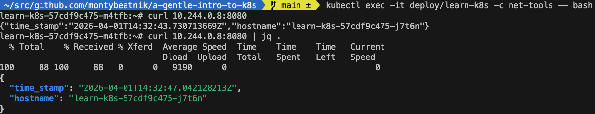

Nice! We got a response from the API, yet we cannot reach it directly from the shell of our machines proper. 

To make that happen, we need to make the service a NodePort (or update the manifest) so it binds to `30080`:

```bash
kubectl patch service learn-k8s -p '{"spec": {"type": "NodePort", "ports": [{"port": 80, "targetPort": 8080, "nodePort": 30080}]}}'
```

You can now hit the app at `http://localhost:8080`.

### Load balancer doing its thing
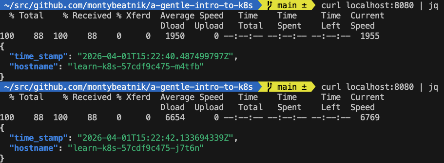

### K8s commands 
```bash
kubectl describe pod learn-k8s-9f554cb4f-6zcgt
```

### Scale out the hard way
```bash
kubectl scale --replicas=3 -f k8s/deployment.yaml
```

### Hit the API again. 
#### Questions
Look at the hostnames. 
- What strategy does the load balancer use?

### You can see both containers in the pod
```bash
kubectl get pod learn-k8s-bc56b56dc-kdtsf -o jsonpath='{range .spec.containers[*]}{"- "}{.name}{"\n"}{end}'

- learn-k8s
- netshoot-sidecar
```

### Run networking commands 
Ensure you're in the net-tools sidecar: 
```bash
kubectl exec -it deploy/learn-k8s -c net-tools -- bash
```

```bash
nslookup learn-k8s 
curl learn-k8s | jq .
```

## Clean up this cluster 
```bash
kind delete cluster --name kind
```

## Add a CNI for BGP Peerings
***Note: Full [guide](https://docs.tigera.io/calico/latest/getting-started/kubernetes/quickstart)***
```bash
cat <<EOF > config.yaml
kind: Cluster
apiVersion: kind.x-k8s.io/v1alpha4
nodes:
  - role: control-plane
  - role: worker
  - role: worker
networking:
  disableDefaultCNI: true
  podSubnet: 192.168.0.0/16
EOF
```

### Start the cluster
```bash
kind create cluster --name=calico-cluster --config=config.yaml
```

### install calico 
```bash
# run in the operator first
kubectl create -f https://raw.githubusercontent.com/projectcalico/calico/v3.31.4/manifests/tigera-operator.yaml
# Check pods 
kubectl get pods --all-namespaces
# once pods are Running, issue the following
kubectl create -f https://raw.githubusercontent.com/projectcalico/calico/v3.31.4/manifests/custom-resources.yaml
# check pods in Calico namespace 
kubectl get pods -n calico-system
```

### setup whisker
```bash
kubectl port-forward -n calico-system service/whisker 8081:8081
```
***Note: Keep this terminal open throughout the rest of this tutorial. The Whisker web console needs the port forwarding to be active to receive logs.***

### Setup namespace and deploy some pods to test connectivity 
```bash
kubectl create namespace quickstart
kubectl create deployment --namespace=quickstart nginx --image=nginx
kubectl expose --namespace=quickstart deployment nginx --port=80
kubectl run --namespace=quickstart access --rm -ti --image busybox /bin/sh
# now run the following to test connectivity to the nginx server from the busybox node
wget -qO- http://nginx
```


### IP Pools 
```bash
kubectl get ippools
kubectl describe ippools default-ipv4-ippool 
kubectl get ippools default-ipv4-ippool -o json | jq . # opmit jq if you don't have it. Or download it. 
```

#### Example
```json
{
  "apiVersion": "crd.projectcalico.org/v1",
  "kind": "IPPool",
  "metadata": {
    "annotations": {
      "projectcalico.org/metadata": "{\"generation\":1,\"creationTimestamp\":\"2026-04-01T18:58:29Z\",\"labels\":{\"app.kubernetes.io/managed-by\":\"tigera-operator\"}}"
    },
    "creationTimestamp": "2026-04-01T18:58:29Z",
    "generation": 1,
    "name": "default-ipv4-ippool",
    "resourceVersion": "1470",
    "uid": "a03c76ec-0d3f-4c7f-8b15-01b6a576d527"
  },
  "spec": {
    "allowedUses": [
      "Workload",
      "Tunnel"
    ],
    "assignmentMode": "Automatic",
    "blockSize": 26,
    "cidr": "192.168.0.0/16",
    "ipipMode": "Never",
    "natOutgoing": true,
    "nodeSelector": "all()",
    "vxlanMode": "CrossSubnet"
  }
}
```

### BGP Peer Info 
```bash
kubectl exec -n calico-system \
    $(kubectl get pods -n calico-system -l k8s-app=calico-node \
    -o jsonpath='{.items[0].metadata.name}') \
    -- birdcl show protocols all
```

```bash
kubectl get nodes -o wide
NAME                           STATUS   ROLES           AGE   VERSION   INTERNAL-IP   EXTERNAL-IP   OS-IMAGE                         KERNEL-VERSION    CONTAINER-RUNTIME
calico-cluster-control-plane   Ready    control-plane   34m   v1.29.1   172.19.0.4    <none>        Debian GNU/Linux 12 (bookworm)   6.4.16-linuxkit   containerd://1.7.13
calico-cluster-worker          Ready    <none>          34m   v1.29.1   172.19.0.3    <none>        Debian GNU/Linux 12 (bookworm)   6.4.16-linuxkit   containerd://1.7.13
calico-cluster-worker2         Ready    <none>          34m   v1.29.1   172.19.0.2    <none>        Debian GNU/Linux 12 (bookworm)   6.4.16-linuxkit   containerd://1.7.13
```


```bash
kubectl exec -n calico-system \
   $(kubectl get pods -n calico-system -l k8s-app=calico-node \
   -o jsonpath='{.items[0].metadata.name}') \
   -- birdcl show protocols

Defaulted container "calico-node" out of: calico-node, flexvol-driver (init), ebpf-bootstrap (init), install-cni (init)
BIRD v0.3.3+birdv1.6.8 ready.
name     proto    table    state  since       info
static1  Static   master   up     16:01:01
kernel1  Kernel   master   up     16:01:01
device1  Device   master   up     16:01:01
direct1  Direct   master   up     16:01:01
Mesh_172_19_0_4 BGP      master   up     16:01:02    Established
Mesh_172_19_0_2 BGP      master   up     16:01:03    Established
Global_192_20_30_40 BGP      master   start  16:17:38    Connect
```

```bash
kubectl exec -n calico-system \
   $(kubectl get pods -n calico-system -l k8s-app=calico-node \
   -o jsonpath='{.items[0].metadata.name}') \
   -- birdcl show route protocol Mesh_172_19_0_4

Defaulted container "calico-node" out of: calico-node, flexvol-driver (init), ebpf-bootstrap (init), install-cni (init)
BIRD v0.3.3+birdv1.6.8 ready.
192.168.240.192/32 via 172.19.0.2 on eth0 [Mesh_172_19_0_4 16:01:02 from 172.19.0.4] * (100/0) [i]
192.168.240.192/26 via 172.19.0.2 on eth0 [Mesh_172_19_0_4 16:01:02 from 172.19.0.4] (100/0) [i]
192.168.156.64/26  via 172.19.0.4 on eth0 [Mesh_172_19_0_4 16:01:02] (100/0) [i]
                   via 172.19.0.4 on eth0 [Mesh_172_19_0_4 16:01:02] (100/0) [i]
```

```bash
kubectl exec -n calico-system \
   $(kubectl get pods -n calico-system -l k8s-app=calico-node \
   -o jsonpath='{.items[0].metadata.name}') \
   -- birdcl show route where bgp_next_hop = 172.19.0.2

Defaulted container "calico-node" out of: calico-node, flexvol-driver (init), ebpf-bootstrap (init), install-cni (init)
BIRD v0.3.3+birdv1.6.8 ready.
192.168.240.192/32 via 172.19.0.2 on eth0 [Mesh_172_19_0_4 16:01:02 from 172.19.0.4] * (100/0) [i]
192.168.240.192/26 via 172.19.0.2 on eth0 [Mesh_172_19_0_2 16:01:03] * (100/0) [i]
                   via 172.19.0.2 on eth0 [Mesh_172_19_0_2 16:01:03] (100/0) [i]
                   via 172.19.0.2 on eth0 [Mesh_172_19_0_4 16:01:02 from 172.19.0.4] (100/0) [i]
```

### Clean up
```bash
kind delete cluster --name calico-cluster
```

### Delete images
```bash
docker image rm learn-k8s:v0.1.0
docker image rm learn-k8s:v0.2.0
```
